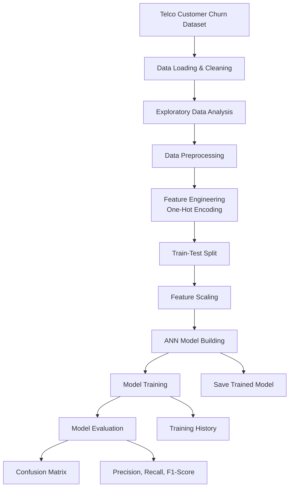
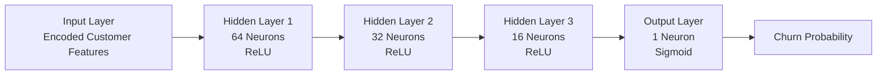

# Telco Customer Churn Prediction using ANN

An end-to-end machine learning and deep learning project that predicts customer churn using an **Artificial Neural Network (ANN)** built with **Keras** (configured with the **PyTorch** backend).


---

##  Overview
Predicting customer churn is a critical problem for telecommunications companies. This project takes raw customer records and processes them through an entire data science pipeline: loading, cleaning, exploratory analysis, preprocessing, building an Artificial Neural Network, and evaluating its performance.

We employ **Keras 3** with a **PyTorch backend** to train a deep learning classifier that decides whether a user is likely to churn.

---


##  Project Structure

```text
telco-customer-churn-prediction_ANN/
│
├── .venv/
│
├── data/
│   ├── telco_cleaned.xlsx
│   ├── Telco_customer_churn.xlsx
│   └── telco_preprocessed.xlsx
│
├── images/
│
├── notebooks/
│   ├── 01_Data_Loading_and_Cleaning.ipynb
│   ├── 02_EDA.ipynb
│   ├── 03_Preprocessing.ipynb
│   ├── 04_ANN_Model.ipynb
│   └── 05_Model_Evaluation.ipynb
│
├── .gitignore
├── model_history.json
├── README.md
├── requirements.txt
└── telco_ann_model.keras
```
---

##  Model Architecture
---
##  Project Workflow


---
##  Neural Network Architecture


---

##  Installation & Setup

1. **Clone the Repository**:
   ```bash
   git clone https://github.com/rupamkgp/telco-customer-churn-prediction_ANN.git
   cd telco-customer-churn-prediction_ANN
   ```

2. **Create and Activate a Virtual Environment**:
   ```bash
   python3 -m venv .venv
   source .venv/bin/activate  # On macOS/Linux
   # or .venv\Scripts\activate on Windows
   ```

3. **Install Dependencies**:
   ```bash
   pip install -r requirements.txt
   ```

  Evaluates the model's metrics, confusion matrix, ROC curve, and saves accuracy/loss history plots.

---

##  Results & Evaluation
* **Training Accuracy**: ~80%
* **Validation Accuracy**: ~80%
* Training logs and curves showing accuracy and loss convergence are saved in `model_history.json` and visualized under `images/`.

---

##  Visualizations
Here are some of the key plots generated during the project workflow:
* **Missing Value Visualization**: Inspects data completeness.
* **Churn Distributions**: Highlighting customer churn dynamics.
* **Correlation Heatmap**: Inspecting relationships between numerical features.
* **Evaluation Curves**: Loss/Accuracy graphs, Confusion Matrices, and ROC curves showing model performance.
